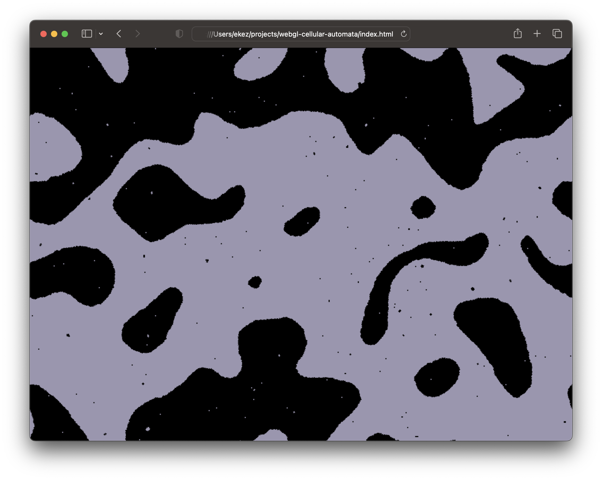

# WebGL2 Cellular Automata

[Live demo.](https://0xekez.github.io/webgl-cellular-automata/)

This software runs a simple cellular automata on the graphics card
from the web browser.

Specifically, it implements the automata described on [page
336](https://www.wolframscience.com/nks/p336--the-phenomenon-of-continuity/)
of Stephen Wolfram's _A New Kind Of Science_. The implementation
follows the approach described by Chris Wellons in [_A GPU Approach to
Conway's Game of Life_](https://nullprogram.com/blog/2014/06/10/).

To see the automata run, clone this repository and open `index.html`.
